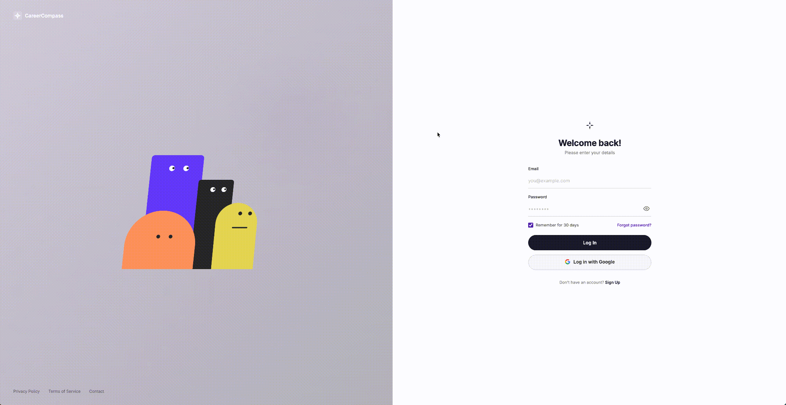

# 带交互动画角色的登录页面



一个带有互动动画角色的登录页面。角色会跟随鼠标移动、对用户输入做出反应，提供生动有趣的登录体验。
## 预览
https://animatedlogin-eta.vercel.app/
### 页面布局
- **左侧面板**：4 个动画角色（紫色矩形、黑色矩形、橙色半圆、黄色圆角矩形）
- **右侧面板**：登录表单（邮箱、密码、登录按钮、Google 登录）

### 交互动画效果

| 场景 | 效果 |
|------|------|
| 空闲 | 角色眼睛跟随鼠标移动，身体微微倾斜 |
| 随机眨眼 | 紫色和黑色角色随机间隔眨眼 |
| 输入邮箱 | 角色互相对视 |
| 输入密码 | 角色转头回避，不看密码 |
| 显示密码 | 角色看向远处，紫色角色偶尔偷看 |
| 登录失败 | 角色露出沮丧表情并摇头 |
| 按钮悬停 | 文字滑出，紫色背景 + 箭头滑入 |

## 技术实现

单 HTML 文件，零依赖：
- **布局**：CSS Grid 两栏布局，响应式适配
- **角色**：纯 CSS 图形（圆角矩形、半圆）
- **动画**：CSS transitions + keyframes + 原生 JavaScript 状态管理
- **交互**：鼠标跟随（mousemove）、焦点检测（focus/blur）、表单校验

## 使用

直接在浏览器中打开 `index.html` 即可。

```bash
open index.html
```

## 文件结构

```
login/
  index.html   # 完整页面（HTML + CSS + JS）
  PRD.md       # 产品需求文档
  README.md    # 项目说明
```

## 参考来源

本项目参考了 [CareerCompass](https://github.com/arsh342/careercompass) 的登录页面动画设计，特别是其 `animated-characters.tsx` 组件的交互逻辑。在此基础上使用原生 HTML/CSS/JS 重新实现，不依赖任何框架。

## License

MIT
